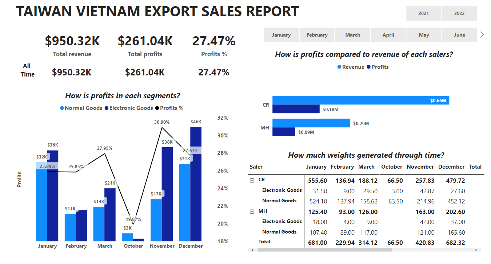

# Export Sale Report

Sales from E-commerce export goods, simple data with simple report:
* Revenue & profits from time start business from Oct 2021 to Mar 2022
* Profit generated from each segments: data show that electronic goods is more profitable than normal goods because Electronic goods calculated by % value of products with lower costs compared to remains which calculated by weight
* Weight accounted much by normal goods

It would be better to see more insights from customers if we can collect the data from senders.
 
 